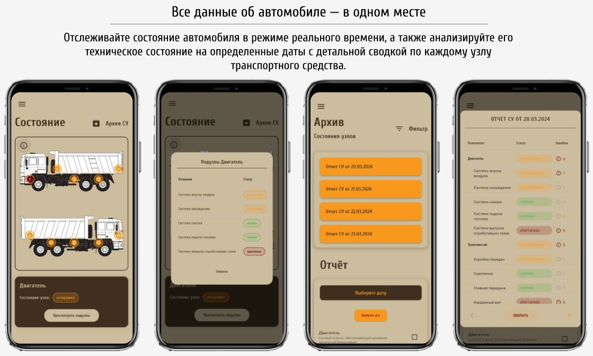
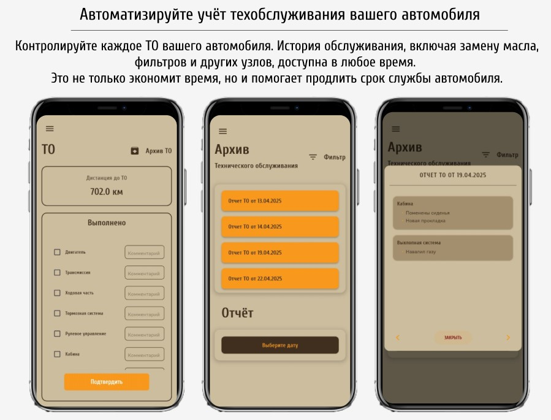

# RadarCars

**RadarCars** — превращает ваш смартфон в умный центр диагностики автомобиля. Контролируйте состояние авто в реальном времени, предотвращайте поломки и экономьте на ремонте.

---

##  Особенности
**Мгновенный мониторинг**:  
- Двигатель, трансмиссия, тормоза и другие ключевые системы.  
- Графики и уведомления о критических изменениях.  

**Контроль технического обслуживания**:  
- Просмотр историй пройденного ТО.
- Запись информации о пройденном ТО.

**Бесплатно и open-source**:  
- Исходный код доступен на [GitHub](https://github.com/radar).  
- Никаких скрытых платежей.  

**Автономная работа**:  
- Полный функционал доступен без интернета.  

*Требуется адаптер OBD-II (совместим с 95% авто с 2000 г.в., например, ELM327).*

# 
# 

## Технологии
- **Flutter + Dart** — кроссплатформенная разработка.  
- **Wi-Fi / Bluetooth** — подключение к OBD-II адаптерам.  
- **HTTP/JSON** — интеграция с внешними API.  
- **CSV-экспорт** — сохранение данных в Excel/Google Таблицы.  

---

## Требования
- **Android**: 8.0+ (API 26), 2 ГБ ОЗУ.  
- **iOS**: 14.0+, поддержка фоновых задач.  

---

## Установка
1. Клонируйте репозиторий:  
   ```bash
   git clone https://github.com/radar.git
   ```
2. Установите зависимости:  
   ```bash
   flutter pub get
   ```
3. Запустите приложение:  
   ```bash
   flutter run
   ```

---


## Лицензия
Проект распространяется под лицензией **MIT**. Подробности в файле [LICENSE](LICENSE).  

---

## Контакты
- Связь с автором: **zxcurve@yandex.ru**  
- Сообщить о баге: [GitHub Issues](https://github.com/radar/issues)  

*Данный проект не заменяет профессиональную диагностику. Используйте на свой риск.*  
